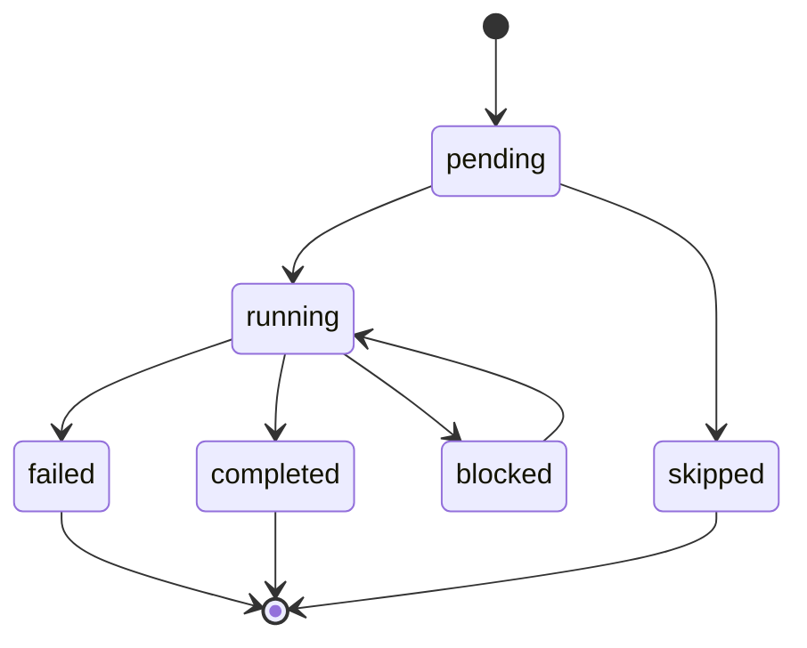

# Agent Plan State 设计

Plan State 是 Agent 执行过程中的运行时计划状态。它替代旧的聊天式 Todo 工具：模型仍然负责提出计划和修订理由，执行器 harness 负责状态校验、持久化、流式下发和失败兜底。

## 状态模型

`PlanRun` 绑定一次会话内的一次 Agent 执行：

- `conversation_id`: 所属会话
- `message_id`: 最终 assistant 消息 ID，执行中为 `0`
- `goal`: 本次计划目标
- `status`: `active/completed/failed`

`PlanItem` 绑定一个计划步骤：

- `status`: `pending/running/completed/blocked/failed/skipped`
- 同一 `PlanRun` 内只允许一个 `running`
- 如果模型创建计划时没有 `running`，harness 会自动推进第一个 `pending`



## Harness 协议

模型通过内部 `plan` 工具控制计划：

- `set`: 创建或重置当前执行计划
- `update`: 更新某些计划项状态或说明
- `revise`: 带原因地替换计划
- `read`: 读取当前计划状态

`plan` 工具结果只进入当前 LLM 上下文，不作为普通聊天历史落库。如果同一轮还有真实工具调用，只持久化真实工具调用和结果。

## 执行循环

每轮 LLM 调用前，执行器把紧凑计划块注入 system message：

```xml
<plan_state>
Goal: ...
Current: [running] ...
Pending:
- ...
Recent change: ...
</plan_state>
```

执行器在关键节点推进状态：

- 首次创建计划后没有 `running` 时，自动运行第一个 `pending`
- 真实工具轮次成功后，将当前 `running` 标为 `completed` 并推进下一个 `pending`
- LLM 调用失败、工具调用失败或达到最大轮次时，将当前 `running` 标为 `failed`
- 最终 assistant 消息保存后，回填 `PlanRun.message_id`

## 持久化与清理

GORM `AutoMigrate` 创建 `plan_runs` 和 `plan_items`。

删除逻辑与消息生命周期同步：

- `DeleteConversation` 删除会话下所有 plan
- `DeleteMessagesFrom` 删除被截断消息之后的 plan，并清理执行中的 `message_id=0` plan
- `ListMessages` 在 assistant 消息上附带对应 `plan` snapshot

## 流式与前端

`model.StreamChunk`、`ChatResponse`、`Message` 都包含可选 `plan` 字段。

SSE 中每次 Plan State 变更都会下发 `plan` chunk，最终 `done` chunk 携带最终快照。前端使用独立“执行计划”面板展示：

- 聊天流式执行时实时更新
- 最终 assistant 消息下保留快照
- 执行日志页展示相同快照，执行步骤 timeline 保持原有职责

## 设计边界

- Plan State 不混入最终回答正文
- 子 Agent 的内部计划不持久化为独立用户可见 plan
- 子 Agent 结果不会自动污染父 plan，除非父模型显式调用 `plan` 修订
- `ExecutionStep` 仍记录工具和 LLM 调用时间线，不复用为计划载体
